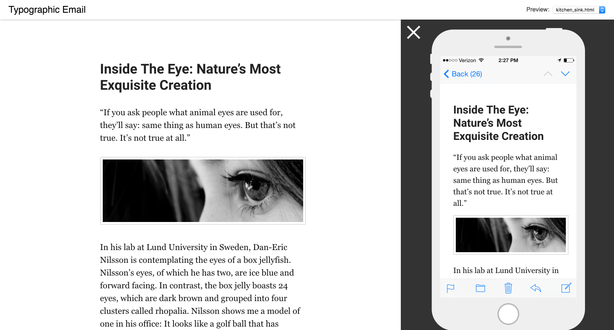

# Typographic Email

This is a responsive email template that is optimized for readability. This is used in my project - [EmailThis](https://www.emailthis.me). I created it because I needed a simple, minimal yet beautiful email template that focusses specifically on readability.


**Side note:** Do check out EmailThis. It is a simpler alternative to Pocket/Readability/Instapaper. EmailThis will remove distractions & ads from an article or web page and send you a nice email with just the text/images. You can then open up the email client on your laptop/mobile and read the article at your leisure. It is completely free, try it out here - [https://www.emailthis.me](https://www.emailthis.me).

Here is a preview of how it looks - 




--------

Feel free to download it & customize it to suit your needs.
I would welcome your suggestions, comments and bug reports.

--------

### Installation
```
git clone https://github.com/emailthis/typographic-email
cd typographic-email
npm install
grunt serve
```

--------

Based on the awesome [Grunt Email Workflow](https://github.com/leemunroe/grunt-email-workflow).

All the credit goes to Lee Munroe for creating a great email workflow. I simply tweaked the styles a little bit. 


---------
Bharani

Maker @ [EmailThis](https://www.emailthis.me)
